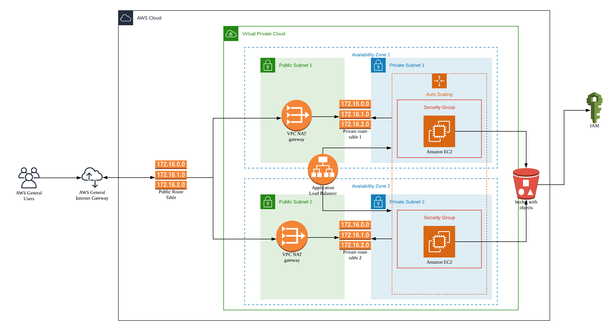

# Deploy a High-Availability Web App using CloudFormation
Udacity Nanodegree Cloud Devops Engineer

## Introduction

In this project, I deployed web servers for a highly available web app using CloudFormation.  I wrote  the code that creates and deploys the infrastructure and application for an Instagram-like app from the ground up. The script begins with deploying the networking components, followed by servers, security roles and software. 

## Architecture Diagram



## Running Project

Create Stack

```
./create.sh UdaGramProject infra-network-server.yml infra-network-server-parameters.json
```
Delete Stack

```
./delete.sh UdaGramProject
```

Files:

```
.
├── Architecture-Diagram.png                 # Architecture Diagram
├── create.sh                                # Script for creating stack
├── destroy.sh                               # Script for deleting stack
├── update.sh                                # Script for updating stack
├── infra-network-server-parameters.json     # Description of CloudFormation infrastructure stack
└── infra-network-server.yml                 # Parameters file for infrastructure stack

```
